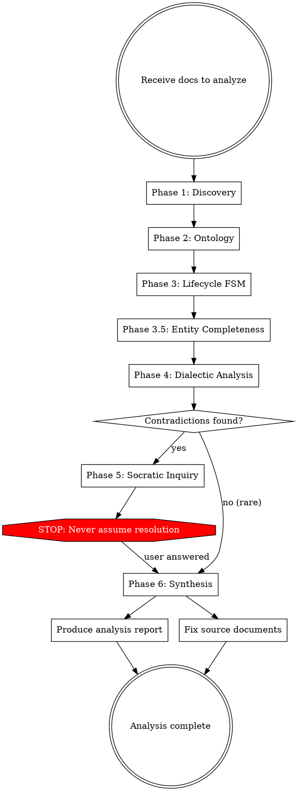
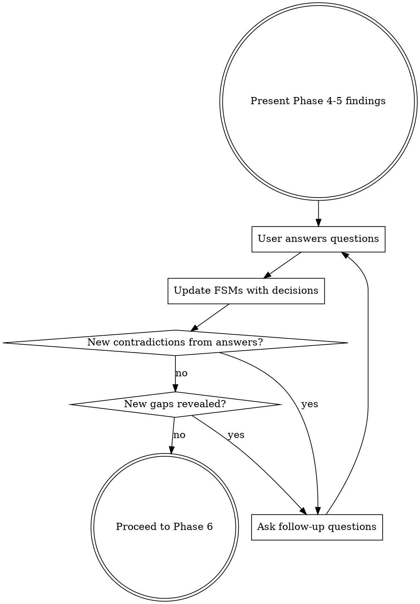

# Spec Dialectic

## Overview

Planning documents lie by omission. This skill applies **dialectical analysis** and **formal methods** to expose contradictions, gaps, and undefined entity lifecycles across specification documents. It forces you to ask — never assume.

**Core principle**: If two documents disagree about the same entity, you have found a **thesis and antithesis**. Do not pick one. Present both and ask for **synthesis**.

## Philosophical Foundation

| Concept | Application |
|---------|-------------|
| **Non-Contradiction** (Aristotle) | Two docs cannot assert contradictory properties for the same entity in the same respect |
| **Socratic Method** | When ambiguity found: ASK, never assume. Frame questions with evidence from both sides |
| **Hegelian Dialectics** | Thesis (doc A) + Antithesis (doc B) → Synthesis (user decision) |
| **Design by Contract** (Meyer) | Every entity operation has preconditions, postconditions, and class invariants |
| **Finite State Machines** | Every lifecycle entity gets a formal FSM with states, transitions, guards, and effects |

## When to Use

- Multiple planning/spec documents exist for a system
- Documents reference each other but may contradict
- Entities have state transitions that need formal definition
- Requirements seem complete but you suspect gaps
- Before implementation begins on a multi-document spec

## When NOT to Use

- Single document with no cross-references
- Pure technical specs (API docs, schemas) with no business logic
- Documents already formalized with state machines

## Core Process



---

## Phase 1: Discovery — Document Inventory

Read ALL documents. For each, extract:

```markdown
| Document | Entities mentioned | States mentioned | Cross-references | Open items |
|----------|-------------------|-----------------|-----------------|------------|
| doc-a.md | Campaign, Material | draft, active   | doc-b.md §3     | 미결 #1~3  |
```

**Key rule**: Read the ENTIRE document. Do not skim. Entities hide in edge cases and footnotes.

**Collect "검토 필요" / "미결" items**: These are the document author's own acknowledged gaps. Catalog them — they are starting points, not the full picture.

---

## Phase 2: Ontology — Entity Classification

For every entity discovered in Phase 1, classify:

| Entity | Type | Has Lifecycle? | Documents defining it |
|--------|------|:--------------:|----------------------|
| Campaign | Core | YES — 5 states | 캠페인관리, 알림관리, 감사로그 |
| Advertiser | Core | PARTIAL — 2 states | 광고주관리 |
| Material | Core | YES — multi-axis | 소재관리, 소재검수, 편성관리 |
| Playlist | Supporting | PARTIAL | 편성관리 |
| User | Core | YES | 사용자관리 |

**Lifecycle entity criteria** — An entity has a lifecycle if ANY of these are true:
- It has 2+ named states (e.g., active/inactive, draft/approved)
- It has time-dependent behavior (start_at/end_at driving state)
- It has deletion constraints based on current state
- Other entities' behavior depends on its state

**Ontological questions to ask yourself**:
- Is this a distinct entity or a state of another entity?
- What attributes are essential (cannot exist without) vs accidental (optional)?
- What are the part-whole relationships (mereology)?

---

## Phase 3: Lifecycle FSM — Formal State Machines

For EVERY entity classified as "Has Lifecycle: YES" or "PARTIAL", produce:

### FSM Template

```markdown
### Entity: [Name]

**States**:
| State | Description | Entry condition | Allowed operations |
|-------|-------------|-----------------|-------------------|
| draft | Initial state after creation | CREATE action | full CRUD |
| active | Currently in use | approval by authorized role | limited update |

**Transitions**:
| From → To | Trigger | Guard (precondition) | Effect (postcondition) | Actor |
|-----------|---------|---------------------|----------------------|-------|
| draft → active | approve() | all required fields set | notify stakeholders | admin |

**Invariants** (must ALWAYS hold):
- INV-1: [entity] in state X cannot have property Y = null
- INV-2: Exactly one [entity] per [parent] can be in state Z

**State diagram**:
[Draw as text-based FSM]
```

### Design by Contract for each transition

Every state transition MUST define:

- **Precondition**: What must be true BEFORE the transition fires
- **Postcondition**: What must be true AFTER the transition completes
- **Invariant**: What must be true at ALL times regardless of state

### Multi-axis states

Some entities have orthogonal state dimensions. Define each axis separately, then specify the composition rules:

```
Material state = (InspectionState, BroadcastState)
- InspectionState: inspecting → passed | failed
- BroadcastState: unlinked → scheduled → active → ended

Composition rule:
- BroadcastState can only be ≠ unlinked if InspectionState = passed
```

---

## Phase 3.5: Entity Completeness Check

Phase 2-3에서 도출한 엔티티 카탈로그와 FSM을 기반으로, 시나리오 문서 내부 완전성과 구현 커버리지를 교차 검증한다.

### Sub-phase A: 시나리오 내부 완전성 (항상 실행)

Phase 2 엔티티 카탈로그의 모든 엔티티에 대해:

**검사 1: 권한-UC 매핑**

각 시나리오 §2 권한 매트릭스에서 CRUD 조작이 정의된 엔티티마다, §3 UC 목록에 해당 엔티티가 주체(primary subject)인 UC가 존재하는지 확인한다.

| Entity | Create UC | Read UC | Update UC | Delete UC | 권한 정의 | Gap? |
|--------|:---------:|:-------:|:---------:|:---------:|:---------:|:----:|

- Gap 발견 시: 권한은 정의되었으나 UC가 없는 조작을 G4로 분류

**검사 2: 의존 완전성**

모든 UC의 전제조건(前提条件)과 단계(Steps)에서 참조되는 엔티티를 수집한다. 참조되었으나 자신이 주체인 UC가 하나도 없는 엔티티를 G2로 분류한다.

**검사 3: 라이프사이클 미정의**

Phase 2에서 라이프사이클 판정 기준(2+ 상태, 시간 의존 동작, 삭제 제약, 타 엔티티 상태 의존)을 충족하면서도 Phase 3에서 FSM이 정의되지 않은 엔티티를 플래그한다.

### Sub-phase B: 구현 커버리지 (구현물이 존재할 때만 실행)

`prototype/` 디렉토리(또는 사용자가 지정한 경로)가 존재하면 entity-coverage-scanner 에이전트를 디스패치한다.

에이전트 입력: Phase 2 엔티티 카탈로그 (이름 한/영, 기대 조작 목록, 원본 UC 번호)
에이전트 출력: 엔티티별 커버리지 분류

| 분류 | 의미 |
|------|------|
| DEDICATED | 전용 디렉토리/페이지 세트 존재 |
| EMBEDDED | 다른 엔티티 페이지 안에 위젯/드롭다운/인라인으로 포함 |
| MISSING | 구현물에서 발견되지 않음 |

Gap 분류:
- G1: CRUD UC가 있으나 전용 페이지 없음 (EMBEDDED 또는 MISSING)
- G3: 라이프사이클 엔티티가 다른 엔티티 UI에 흡수됨

### 출력 — 엔티티 완전성 테이블

기존 엔티티 카탈로그 테이블에 2개 컬럼을 추가한다:

| Entity | Type | Lifecycle | 정의 문서 | 상태 수 | UI 커버리지 | Gap |
|--------|------|:---------:|----------|:-------:|:----------:|:---:|

### Phase 5 연계

발견된 각 Gap은 Phase 5(Socratic Inquiry)에서 질문으로 전환한다:

```markdown
**[Entity] — 독립 UI 필요 여부**

시나리오에서 [근거]로 독립 라이프사이클을 가진 엔티티입니다.
현재 구현에서는 [other entity]의 [page]에 [형태]로 포함되어 있습니다.

→ 선택지:
- A) 전용 CRUD 페이지 신설
- B) 현재처럼 다른 엔티티에 포함 유지
- C) 하이브리드 (목록은 별도, 생성/편집은 인라인)
```

---

## Phase 4: Dialectic Analysis — Contradiction Detection

For each entity, compare its definition across ALL documents that mention it. Apply the **Non-Contradiction Principle**:

> "The same attribute cannot at the same time belong and not belong to the same subject in the same respect." — Aristotle

### Check for these contradiction types:

| Type | Description | Example |
|------|-------------|---------|
| **State contradiction** | Different documents define different states for the same entity | Doc A: 3 states, Doc B: 5 states |
| **Transition contradiction** | Different documents define different triggers/guards for the same transition | Doc A: auto-transition, Doc B: manual approval |
| **Permission contradiction** | Different documents assign different permissions for the same operation | Doc A: role X can do it, Doc B: role X cannot |
| **Existence contradiction** | One doc references a state/entity/field that another doc explicitly excludes | Doc A: "rejection" event, Doc B: no rejection state |
| **Constraint contradiction** | Different deletion/modification constraints for the same entity | Doc A: soft delete, Doc B: hard delete |
| **Temporal contradiction** | An older document and a newer document disagree, but it's unclear which supersedes | Both dated same day |

### Dialectic Record Format

For each contradiction found:

```markdown
#### Contradiction C-[N]: [Title]

**Thesis** (Doc A, §section): [What doc A asserts]
**Antithesis** (Doc B, §section): [What doc B asserts]
**Impact**: [What breaks if unresolved]
**Proposed synthesis**: [Your suggested resolution — ALWAYS present as a question]
```

---

## Phase 5: Socratic Inquiry — Ask, Never Assume

**This is the most critical phase.** When you find a contradiction or ambiguity, you MUST ask the user. Never resolve it yourself.

### Question Framing Rules

1. **Present both sides with evidence**: Quote the specific sections from each document
2. **State the impact**: Explain what breaks if the contradiction is unresolved
3. **Offer options**: Present 2-3 possible resolutions with trade-offs
4. **Never lead**: Don't phrase questions to suggest your preferred answer

### Question Template

```markdown
**[Entity] — [Issue title]**

문서 A (`doc-a.md` §N)에서는 [assertion A]라고 정의합니다.
문서 B (`doc-b.md` §M)에서는 [assertion B]라고 정의합니다.

이 두 정의는 [specific respect]에서 모순됩니다.
해결하지 않으면 [impact description]이 발생합니다.

→ 선택지:
- A) [Option A] — 장점: ... / 단점: ...
- B) [Option B] — 장점: ... / 단점: ...
- C) [Other option or "둘 다 틀림, 새로운 정의 필요"]
```

### What to ask about:

- Every contradiction from Phase 4
- Every lifecycle entity with "PARTIAL" lifecycle definition
- Every state transition missing a guard or postcondition
- Every permission matrix cell with ambiguous scope ("권한 범위 내")
- Every cross-entity dependency with undefined cascade behavior
- Every "미결" item that blocks another entity's FSM

### Batch questions efficiently

Group related questions together. Don't ask one at a time if 5 questions relate to the same entity. Present the entity's full FSM draft with `[?]` markers at each ambiguous point.

---

## Phase 6: Synthesis — Outputs

After the user answers all questions, produce TWO outputs:

### Output A: Analysis Report

Create `spec-analysis-report.md` with:

1. **Entity Catalog**: All entities with classification
2. **Lifecycle FSMs**: Complete state machines for all lifecycle entities
3. **Resolved Contradictions**: Each contradiction with the user's decision and rationale
4. **Remaining Gaps**: Items still undefined (with severity rating)
5. **Cross-Entity Invariants**: System-wide rules that span multiple entities
6. **Dependency Graph**: Which documents/entities depend on which

### Output B: Document Fixes

For each source document, apply fixes:
- Remove contradicted statements (replaced with resolved version)
- Add missing entity lifecycle sections
- Add missing state definitions
- Update cross-references
- Preserve "미결" items that are genuinely unresolved
- Add `[RESOLVED]` tag to items resolved during this analysis

**Rule**: Never silently change a document. Show the user what you intend to change and get approval first.

---

## Cross-Entity Invariant Patterns

These invariants frequently apply across planning document sets. Check each:

| Pattern | Check |
|---------|-------|
| **Cascade delete** | If entity A is deleted, what happens to entities that reference A? |
| **State gate** | If entity A must be in state X before entity B can transition, is this documented? |
| **Permission consistency** | If role R has permission P in doc A, does doc B agree? |
| **Derived state** | If entity A's state depends on entity B's state, is the derivation rule defined? |
| **Temporal ordering** | If entity A must exist before entity B, is this dependency documented? |
| **Scope inheritance** | If user has access to entity A, do they automatically access related entity B? |

---

## Red Flags — STOP and Ask

If you catch yourself thinking any of these, STOP:

| Thought | Reality |
|---------|---------|
| "This is probably just an oversight" | It might be a deliberate design decision. Ask. |
| "I'll pick the more recent document" | You don't know which is authoritative. Ask. |
| "The intent is obvious" | If it were obvious, it wouldn't be contradictory. Ask. |
| "This contradiction doesn't matter" | Contradictions in specs become bugs in code. Always matters. |
| "I'll note it and move on" | Noting without resolving just defers the bug. Resolve now. |
| "The user will figure it out" | The user hired you to find it. Present it clearly. |
| "This is too many questions" | Better 20 questions now than 20 bugs later. Ask all of them. |

---

## Iterative Inquiry Protocol

Analysis is NOT a single pass. Follow this loop:



**User decisions can create NEW contradictions.** For example, resolving "Campaign has no rejection state" might create a new conflict with the notification event catalog. Always re-check after incorporating decisions.

---

## Prior Decision Tracking

When the user has already made decisions (e.g., in conversation before invoking this skill), honor them:

1. **Catalog prior decisions** before starting Phase 4
2. **Do not re-ask** questions the user has already answered
3. **Apply prior decisions** as constraints when evaluating contradictions
4. **Flag if a prior decision creates a NEW contradiction** — this is a follow-up question, not a re-ask

Example: If user said "캠페인에 반려 상태 없음", then:
- Mark 알림관리 event #3 as needing fix (remove 반려 event)
- Do NOT ask "캠페인에 반려 상태가 필요한가요?"
- DO ask "알림관리 event #3에서 반려 이벤트를 삭제하면, 승인 워크플로우에 이상 시나리오(승인 거부)가 없어도 되나요?"

---

## Multi-Axis State Composition Rules

When an entity has orthogonal state dimensions, you MUST define:

1. **Each axis independently** with its own FSM
2. **Composition constraints** — which combinations are valid/invalid
3. **Transition priority** — when both axes could transition, which takes precedence
4. **Display state** — how the composed state appears to users (single label? badge combo?)

### Invalid Composition Table Template

```markdown
| InspectionState | BroadcastState | Valid? | Reason |
|----------------|---------------|:------:|--------|
| inspecting | unlinked | YES | Default after registration |
| inspecting | scheduled | NO | Cannot schedule uninspected material |
| passed | active | YES | Normal operation |
| failed | active | NO | Failed material cannot be broadcast |
```

This table catches hidden contradictions that a single-axis FSM misses.

---

## Permission Consistency Matrix

For each operation, build a cross-document permission matrix:

```markdown
| Operation | user-mgmt.md | domain-doc.md | Match? |
|-----------|-------------|--------------|:------:|
| Material CRUD | O(권한 범위 내) | O(권한 범위 내) | YES |
| Playlist CRUD | X | — (not mentioned) | [?] ASK |
```

If a document doesn't mention a permission, that's NOT "no permission" — it's **undefined**. Mark as `[?]` and ask.

---

## Common Rationalizations for Skipping Phases

| Excuse | Reality |
|--------|---------|
| "Phase 1 is just reading, I can skim" | Entities hide in edge cases. Read everything. |
| "This entity only has 2 states, no FSM needed" | 2 states = 2 transitions + invariants. Still needs formal definition. |
| "The documents mostly agree" | "Mostly" means there are contradictions. Find them. |
| "I already found the big issues" | Small issues compound. Finish all phases. |
| "The user only asked about entity X" | Entities are interconnected. Analyze all of them. |
| "I'll define the FSM informally" | Informal = ambiguous. Use the template. |
| "The user already answered, skip the check" | User decisions can create new contradictions. Re-check FSMs. |
| "This permission gap is obvious" | Undefined ≠ denied. Undefined = must ask. |
| "I'll batch all questions at the end" | Group by entity, but present as you find them. Don't hold back critical blockers. |
